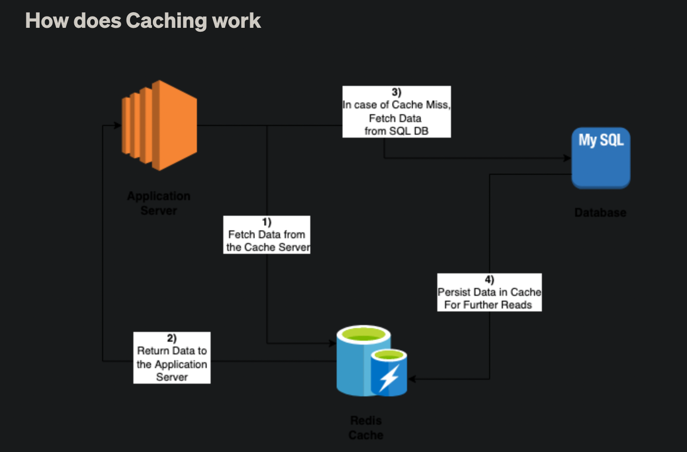

# Caching 101

## 1. What is caching

* Caching is a process by which read access of the data (files, images, scripts etc) is optimised by storing multiple copies in storage locations (local/remote) called as caches
  * caching은 새 저장소에 기존 data들을 복사함으로써 읽기 작업에 최적화를 하는 작업을 의미한다.

*  Caching is designed to scale distributed application needs by reducing the read load on database servers and thus in turn improving the read API latency.
   * 캐싱은 분산된 application에서 read API 속도를 향상시킬 수 있다.

### 1-1) 캐시 동작과정 이미지

* 먼저 cache서버로 요청을 보내고, cache miss가 날 경우 db로부터 데이터를 가져온다.
  * 해당 전략은 cache 전략 중 `lazy load` 이거나, `write through`이다.

## 2. why cache is faster than DB

1. cache memory는 `Static Ram` 을 사용한다. 갱신이 필요한 `Dynamic Ram` 을 사용하지 않기 때문에 더 빠르다.
2. 데이터를 추가할 때, `instroctuons(명령어)`를 추가적으로 저장해서 더 빠르게 접근할 수 있다.

* [Caching 101](https://blog.devgenius.io/caching-101-634ef4f8ed1b)
* date
  * 22.07.14

