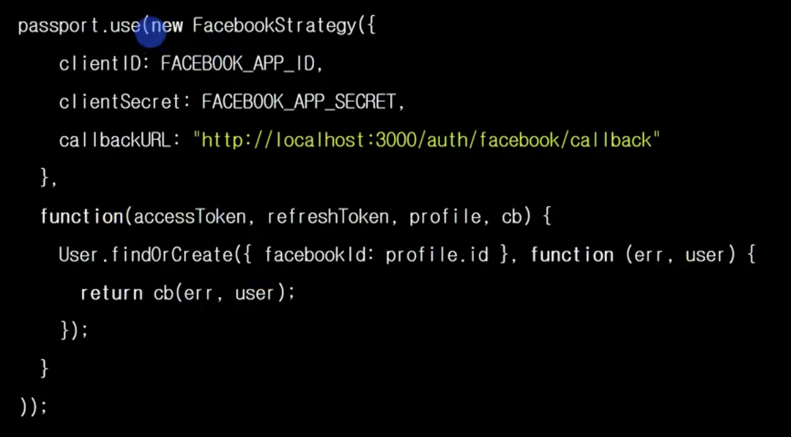

# 싱글톤 패턴

## 1. 싱글톤 패턴이란?

* 하나의 클래스에 오직 하나의 인스턴스만 가지는 패턴
  * 장점
    * 인스턴스를 생성할 때의 비용이 줄어든다.
  * 단점
    * 의존성이 높아진다.

### 1-1) 싱글톤 패턴의 예

* DB와의 연결 작업은 IO가 많은 IO Bound이고, IO Bound는 비용이 높다.
  * 그렇기 때문에 매 연결마다 DB와 연결을 하는 것이 아니고, 미리 DB와 연결해놓고 사용자에게 요청을 반환해준다.
* DB연결할 때 많이 사용된다.

### 1-2) 걸림돌 -> TDD

* TDD를 할 때는 독립적으로 실행할 수 있어야 하는데, 싱글톤은 오직 인스턴스가 하나이므로 각 테스트마다 독립적인 환경을 만들기 어렵다.

## 2. 예시

> * [SingletonTest](SingletonTest.java)

 

# 팩토리 패턴

## 1. 개요. 팩토리 패턴이란?

상위 클래스에서 중요한 뼈대를 결정하고, 하위 클래스에서는 객체 생성에 관한 구체적인 내용을 결정하는 패턴이다.

상위 클래스와 하위 클래스가 분리되기 때문에 다음과 같은 특성을 갖는다.
* 느슨한 결합
* 더 많은 유연성

객체 생성 로직이 따로 떼어져 있기 때문에 코드를 리팩토링 하더라도 한 곳만 수정해도 되니, 유지 보수성이 증가한다.

 

# 이터레이터 패턴

## 1. 이터레이터 패턴이란

* iterator를 이용하여 컬렉션의 요소들에 접근하는 디자인 패턴
  * 다르게 자료형 구조를 갖고 있더라도 이터레이터라는 하나의 인터페이스로 순회가 가능하다.

# 전략 패턴

## 1. 전략 패턴이란?

* strategy pattern - policy(정책) 이라고도 불린다
* 캡슐화한 알고리즘을 context 안에서 바꿔주며 상호 교체가 가능하게 하는 패턴이다.
* 예시) `passport`의 전략 패턴
  * `passport`? 
    * node.js에서 인증 모듈을 구현할 때 사용하는 라이브러리

보면 `passport.use()` 안에 각각의 다른 strategy를 넣어줌으로써 회원 인증을 구현하고 있는 것을 볼 수 있다.

* 자바에서의 예

