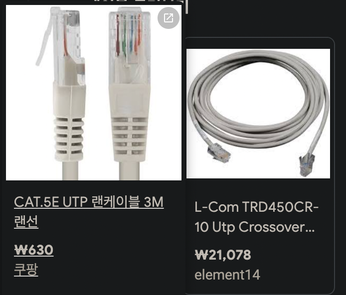

# 2장 신호의 전송과 충돌

## 1. 1계층의 역할과 개요

* 역할
  * 케이블에 연결돼 있는 기기에 data를 전달하는 것
  * 2계층부터는 데이터를 보내기전에 어떤 일을 할 지, 데이터를 받은 이후에 어떤 일을 할 지에 대한 역할이다.

* 전기신호 선(유선)
  * 동선
    * 동선 케이블 -> UTP
      * 8개의 동선이 뭉친 케이블
      * 2개가 1쌍으로 돼 있다.
        * 광파이버 케이블도 많이 보급됐지만, 아직은 UTP가 압도적으로 많다.
  * 광파이버
    * 광신호 사용

* UTP 이미지

## 2. 신호와 충돌

* 인터페이스의 역할
  * 비트를 신호로, 신호를 비트로 변환하는 기기

* 통신속도
  * 1초 동안 전해지는 비트 수 (bps - bit per second)
    * 여러 비트가 표현되게 하고, 비트를 짧게 보내서 여러 비트를 보내면 통신속도가 늘어난다.
      * 대신 이렇게 하면 수신쪽에서 제대로 인식하지 못하거나, 에러 확률이 높아진다.

* 증폭
  * 장거리 신호 운반의 경우 증폭이 필요하다.
  * 감쇠, 노이즈, 충돌 등의 위협이 있기 때문이다.

## 3. 허브

* 허브의 역할
  * 허브에 케이블로 연결 돼 있는 기기들은 동일 케이블에 연결 돼 있는 효과를 받는다.
    1. 허브는 신호의 증폭과 재생의 역할을 한다.
    2. 허브는 복수의 기기를 연결해서 네트워크를 구축한다.

* flooding(플러딩)
  * 허브는 수신한 포트 이외의 모든 포트에 수신한 신호를 송신한다.
  * 이렇게 들어온 거를 다 쏴버리면 충돌이 발생할 수 있다.
    * 그래서 허브에서 충돌 도메인이 생긴다.

* 충돌 도메인
  * 신호를 받으면 충돌이 발생할 지도 모르는 범위를 의미한다.
  * 허브는 수신한 신호에 대해서 어떠한 간섭도 하지 않는다.
  * 그래서 허브에 연결된 기기들에 대해서 충돌 도메인이 발생할 확률이 높아진다.
    * 당연하게도 충돌 도메인은 작을 수록 좋다.

## 4. 2계층

* 2계층의 역할
  * 세그먼트 범위에서의 데이터 전송
    * 세그먼트 : 패킷 교환없이 신호가 닿는 범위
  * 세그먼트를 넘은 데이터는 패킷 교환기인 라우터를 통해서 보낸다. 즉, 3계층 이상의 일이다.

* 신호 규격
  * 1계층의 신호와 케이블에 따라 2계층 규격도 달라진다.
    * 즉, LAN용, WAN용이 다르다.
    * 해당 책은 LAN용에 대해서만 설명한다.
    * LAN의 사실상 표준은 ethernet이다.

* 프레이밍(framing)
  * 송수신되는 신호를 데이터로 인식할 수 있게 해준다.
    * 예를 들어, 프레이밍 안에 프리엠블(preamble)이라는 것이 있다.
      * 해당 신호를 통해 신호의 시작점을 알 수 있다.
    * 이는 비트를 읽는 시점이 송신측과 수신측이 일치해야하므로 사용하는 것이다.

